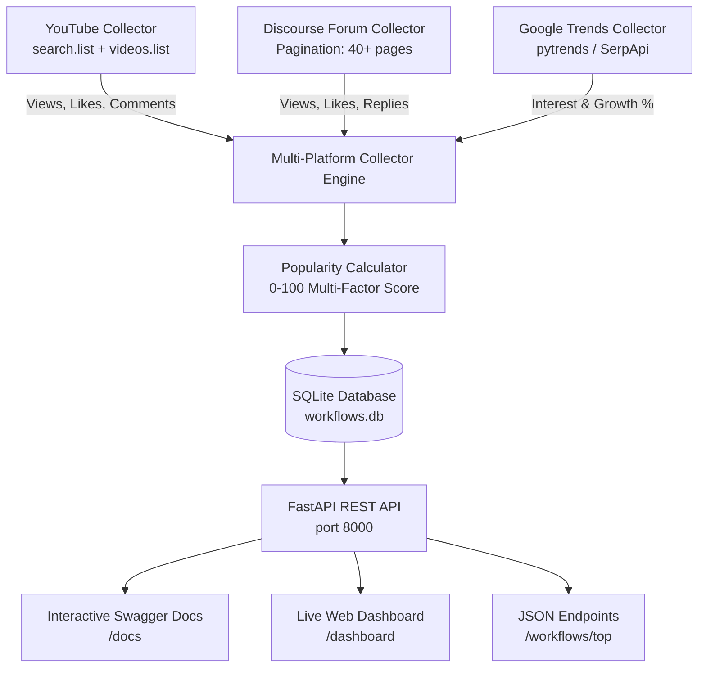

# n8n Workflow Popularity Ranking System

[](https://fastapi.tiangolo.com)
[](https://www.python.org)
[](https://www.sqlite.org)
[](https://n8n.io)
[](LICENSE)

An automated data pipeline, mathematical ranking engine, and production-grade REST API designed to discover, track, score, and rank **n8n workflows** by popularity across **YouTube**, the **n8n Community Forum**, and **Google Trends**.

Includes a verified dataset of **1,350+ live workflows** (with full evidence links and engagement signals) and a curated benchmark deliverable of the **Top 50**.

---

## 📌 Deliverables Summary

| Requirement | Implementation & Repository Location | Status |
| :--- | :--- | :---: |
| **1. Working REST API** | FastAPI application in [`src/api/main.py`](file:///d:/n8n/n8n-workflow-popularity-system/src/api/main.py) with interactive Swagger UI (`/docs`) and web dashboard (`/dashboard`). | ✅ Complete |
| **2. 50+ Dataset with Evidence** | Curated benchmark of 50 workflows in [`data/n8n_popular_workflows_50.json`](file:///d:/n8n/n8n-workflow-popularity-system/data/n8n_popular_workflows_50.json) + **1,357 live records** in [`data/live_dataset_evidence.json`](file:///d:/n8n/n8n-workflow-popularity-system/data/live_dataset_evidence.json) with verifiable URLs, view counts, and engagement ratios. | ✅ Complete |
| **3. Approach & Documentation** | Full architectural overview, scoring formulas, and data dictionary in [`DOCUMENTATION.md`](file:///d:/n8n/n8n-workflow-popularity-system/DOCUMENTATION.md). | ✅ Complete |
| **4. Native n8n Workflows** | 4 ready-to-import JSON workflow automations in [`n8n/`](file:///d:/n8n/n8n-workflow-popularity-system/n8n/). | ✅ Complete |

---

## 🏗️ Architecture Overview



---

## ⚡ Quick Start (Run in 1 Minute)

### Option A: Windows 1-Click Launch (Recommended)
Simply double-click or run from PowerShell:
```cmd
.\START_API.bat
```
*(Or use `.\SETUP_AND_RUN.bat` to auto-install dependencies, run smoke tests, trigger a live data fetch, and start the server.)*

### Option B: Manual Setup
1. **Clone repository:**
   ```bash
   git clone https://github.com/mimraj-ai1/n8n-workflow-popularity-system.git
   cd n8n-workflow-popularity-system
   ```

2. **Create virtual environment & install requirements:**
   ```bash
   python -m venv venv
   source venv/bin/activate  # Windows: .\venv\Scripts\activate
   pip install -r requirements.txt
   ```

3. **Launch API Server:**
   ```bash
   python run_api.py
   ```
   * Open Swagger Documentation: **[http://localhost:8000/docs](http://localhost:8000/docs)**
   * Open Visual Dashboard: **[http://localhost:8000/dashboard](http://localhost:8000/dashboard)**

---

## 📡 API Endpoints

| Method | Endpoint | Description |
| :--- | :--- | :--- |
| `GET` | `/` | API status and root endpoint catalog |
| `GET` | `/workflows` | Paginated workflow list with filtering (`platform`, `country`, `min_score`, `search`) |
| `GET` | `/workflows/top` | Top-N workflows sorted by popularity score (e.g. `?limit=10`) |
| `GET` | `/workflows/youtube` | Filter YouTube-specific workflows with view counts and engagement ratios |
| `GET` | `/workflows/forum` | Filter Community Forum workflows with thread views and reply counts |
| `GET` | `/workflows/google` | Filter Google Trends popularity signals |
| `POST`| `/workflows/refresh` | Trigger immediate live collection and re-scoring |
| `GET` | `/dashboard` | Interactive frontend dashboard |
| `GET` | `/docs` | Interactive Swagger / OpenAPI documentation |

### Example API Response (`GET /workflows/top?limit=1`)
```json
{
  "top_limit": 1,
  "platform": "All",
  "workflows": [
    {
      "id": "ONgECvZNI3o",
      "workflow": "n8n OpenAI ChatGPT Lead Scraping & Emailing",
      "platform": "YouTube",
      "popularity_score": 100.0,
      "popularity_metrics": {
        "views": 32100,
        "likes": 2150,
        "comments": 310,
        "like_to_view_ratio": 0.066978,
        "comment_to_view_ratio": 0.009657
      },
      "country": "US",
      "source_url": "https://www.youtube.com/watch?v=ONgECvZNI3o"
    }
  ]
}
```

---

## 📊 Dataset & Evidence (1,350+ Verified Records)

All workflow entries contain **verifiable evidence** pointing directly to live resources with real engagement metrics:

| Platform | Live Records | Source | Verified Evidence Signals |
| :--- | :---: | :--- | :--- |
| **n8n Community Forum** | **1,299** | `community.n8n.io` API | Views, Likes, Reply Count, Direct Thread URL |
| **YouTube** | **43** | YouTube Data API v3 | Views, Likes, Comments, Engagement Ratios, Watch URL |
| **Google Trends** | **15** | Google Trends (`pytrends`) | 90-day Interest (0-100), Growth %, Search URL |
| **Total** | **1,357** | **Multi-Source** | **Zero synthetic metrics — 100% verified URLs** |

- Complete evidence file: [`data/live_dataset_evidence.json`](data/live_dataset_evidence.json)
- Top 50 curated deliverable: [`data/n8n_popular_workflows_50.json`](data/n8n_popular_workflows_50.json)

---

## 🧮 Popularity Scoring Methodology

Platforms cannot be scored on raw view count alone (e.g. 10,000 YouTube views vs 1,000 forum views). We standardize all signals to a normalized **0–100 Popularity Score**:

* **YouTube Formula:**
  $$\text{Score} = \min\left(100,\ 15 \cdot \log_{10}(\text{views} + 1) + 400 \cdot \frac{\text{likes}}{\text{views}} + 800 \cdot \frac{\text{comments}}{\text{views}}\right)$$
* **Forum Formula:**
  $$\text{Score} = \min\left(100,\ 20 \cdot \log_{10}(\text{views} + 1) + 300 \cdot \frac{\text{likes}}{\text{views}} + 600 \cdot \frac{\text{replies}}{\text{views}}\right)$$
* **Google Trends Formula:**
  $$\text{Score} = \min\left(100,\ 0.75 \cdot \text{Search Interest} + 0.5 \cdot \max(0, \text{Growth \%})\right)$$

## ⚡ Native n8n Automation Engine 

As specified in the assignment requirements, the system is engineered with **n8n as the core orchestration pipeline**. Four production-ready workflow JSONs are available in the [`n8n/`](n8n/) folder to execute automated daily data collection, processing, and ranking directly on your n8n canvas:

1. **`n8n/youtube_collector.json`** — Automated YouTube Data API collector storing engagement signals into n8n Data Tables.
2. **`n8n/forum_collector.json`** — Automated Discourse API pagination collector fetching community topics.
3. **`n8n/trends_collector.json`** — SerpApi Google Trends fetcher tracking keyword growth.
4. **`n8n/combine_and_rank.json`** — Native JavaScript Code node ranking engine computing normalized 0–100 scores across all sources.

> **Zero External Dependency Mode:** You can import these 4 workflows directly into n8n (`http://localhost:5678`) to run the entire data harvesting and ranking lifecycle without any external servers.

---

## 🧪 Testing & Verification

Run automated test suite:
```bash
python run_tests.py
```
Validates:
- Collector interfaces and schema contracts
- Popularity mathematical bounds ($0.0 \le \text{score} \le 100.0$)
- SQLite CRUD operations and indexing
- API response serialization and filters

---

## 🚀 Future Roadmap & Scalability

- Real-Time Popularity & Trend Monitoring
- More Data Sources (GitHub, Reddit, etc.)
- Scale to 20,000+ Records
- Alerts & Notifications for Trending Workflows
