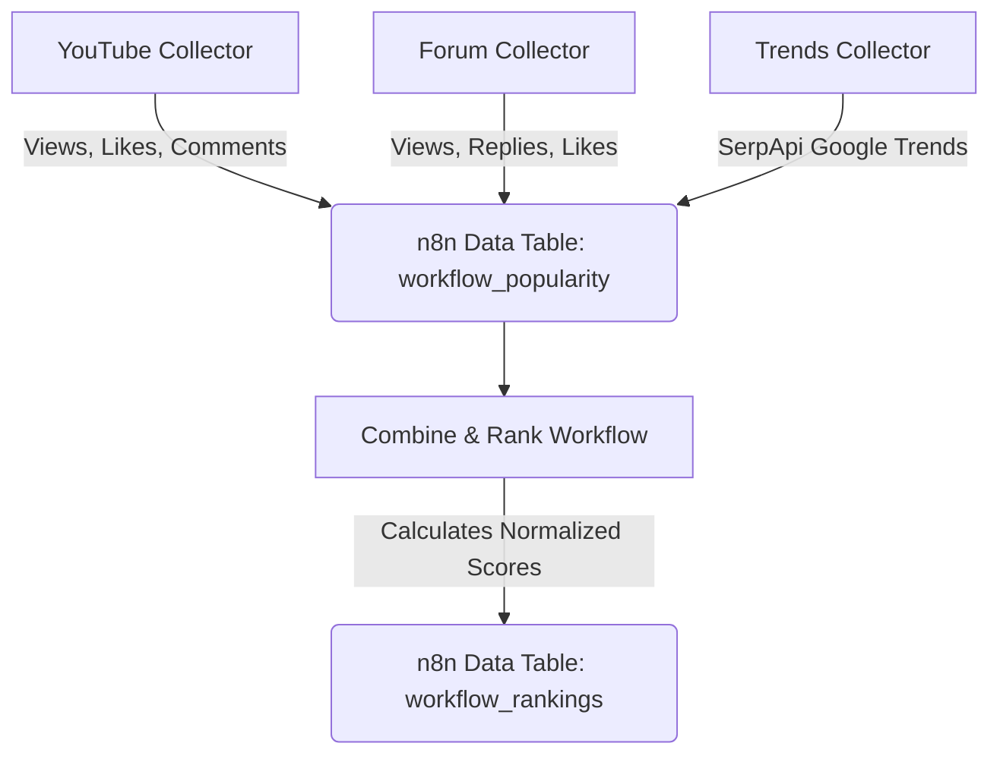

# n8n Workflow Popularity System (100% n8n Native)

A production-ready, serverless-style system that automatically tracks, scores, and ranks popularity data for n8n workflows across **YouTube**, the **n8n Community Forum**, and **Google Trends**.

This project has been completely refactored to run **100% natively inside n8n** without any external Python API or PostgreSQL database. It utilizes n8n's native Data Tables for storage and Code nodes for scoring logic.

---

## Architecture Overview



**Key Features:**
- **Zero External Infrastructure:** No database to host, no Python APIs to maintain.
- **Native Storage:** Uses n8n Data Tables for all storage and historical tracking.
- **Automated Ranking:** Computes normalized popularity scores (0-100) combining diverse metrics across platforms.

---

## Prerequisites

- n8n v1.0+ (supports Data Tables)
- **YouTube Data API v3 Key** (Free tier is sufficient)
- **SerpApi Key** (For Google Trends data)

---

## Installation & Setup

### 1. Start n8n
If you don't have n8n running, you can start it locally using Docker Compose:

```bash
docker compose up -d
```
Access n8n at `http://localhost:5678`.

### 2. Set Up Credentials in n8n
Before importing workflows, you need to create the required API credentials in n8n:
1. **YouTube API Key:** Go to Credentials -> Add Credential -> `HTTP Request` -> Custom Auth. Add a Header/Query param for your API Key.
2. **SerpApi Key:** Create an account at serpapi.com and add the key to a predefined `SerpApi` credential in n8n.

### 3. Create Data Tables
You need to create two Data Tables in n8n:
1. Go to **Data -> Add Table**.
2. Name it `workflow_popularity`.
3. Add columns corresponding to the metrics (e.g., `workflow`, `platform`, `views`, `likes`, `comments`, `source_id`, `popularity_score`, etc.).
4. Create a second table named `workflow_rankings`.

### 4. Import Workflows
Import the 4 JSON workflows from the `n8n/` directory into your n8n workspace:
- `n8n/youtube_collector.json`
- `n8n/forum_collector.json`
- `n8n/trends_collector.json`
- `n8n/combine_and_rank.json`

> [!IMPORTANT]
> **Relink Data Tables:** Because Data Table IDs change per n8n instance, you must open each imported workflow, click the **Upsert Row** or **Get Source Rows** node, and select your newly created tables from the dropdown.

---

## Automated Scheduling
All collectors run automatically on a daily schedule:
- **YouTube/Forum/Trends Collectors:** Run daily at 6:00 AM.
- **Combine + Rank Collector:** Runs daily at 7:00 AM to process the newly collected data.

---

## Scoring System
Scores are generated natively via JavaScript in n8n Code nodes. 
- Log-normalization is used for high-variance metrics like views.
- Ratio-based scoring rewards highly engaging content (e.g., Comments-to-Views ratio).
- Final output scales from `0-100` and normalizes across all platforms.
